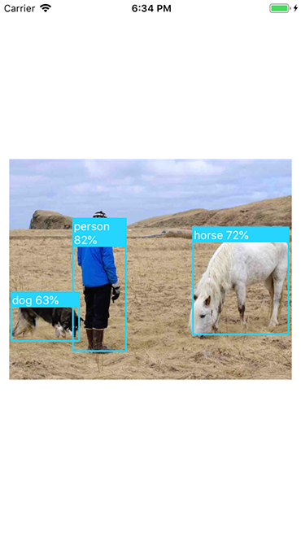

# tflite-react-native example

Use tflite-react-native plugin to run model on images.

 

## Prerequisites

1. Download the folder `models` and its contents from https://github.com/shaqian/tflite-react-native/tree/master/example/models. Place the folder at the root of ./example.

2. Open ./example/ios/example.xcworkspace in XCode. Right click on the `example` in the left panel, click **Add Files to "example"...**, select the `models` folder.

3. Copy `models` folder and paste it in ./example/android/app/src/main/assets.


## Installation 

```
npm install
```

* For iOS, TensorFlow Lite is installed using POD:

```
cd ios
pod install
```

* For Android, a conversion to AndroidX is necessary (for now):

```
npm run jetify
```

## Run the App

### iOS

```
react-native run-ios
```

### Android

```
react-native run-android
```
